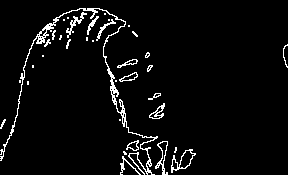
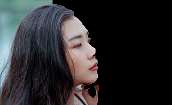

# Sigma ML - Quiz 3

This project showcases several common image processing techniques implemented using Python and OpenCV. It involves processing a portrait image to perform contrast enhancement, extracting a binary mask, detecting edges using morphological operations and the Canny edge detector, and segmenting the foreground using the GrabCut algorithm.

## Features
- **Contrast Enhancement**: Uses Histogram Equalization on the HSV Value channel to improve contrast.
- **Mask Extraction**: Applies Otsu's Thresholding to extract the person's binary mask.
- **Edge Detection**: Extracts edges using both Morphological Gradient and the Canny Edge Detector.
- **Image Segmentation**: Utilizes OpenCV's GrabCut algorithm to segment the foreground (person) from the background.

### Input: 
- **Input Image**  
  

### Output:

- **Contrast Enhanced Image**  
  

- **Binary Mask with Otsu’s Thresholding**  
  

- **Edge Detection using Morphological Gradient**  
  
  
- **Edge Detection using Canny Edge Detector**  
  

- **Image Segmentation with GrabCut**  
  

### License

This project is licensed under the MIT License.
